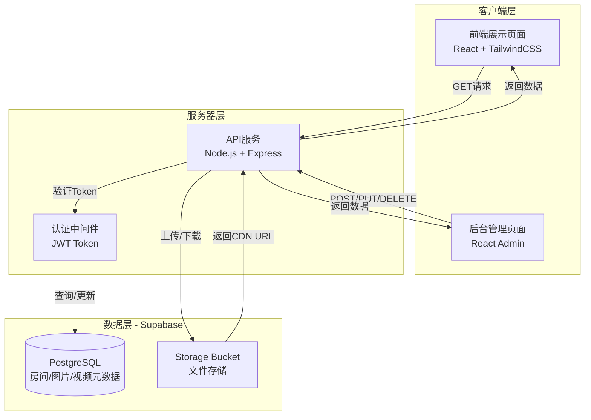
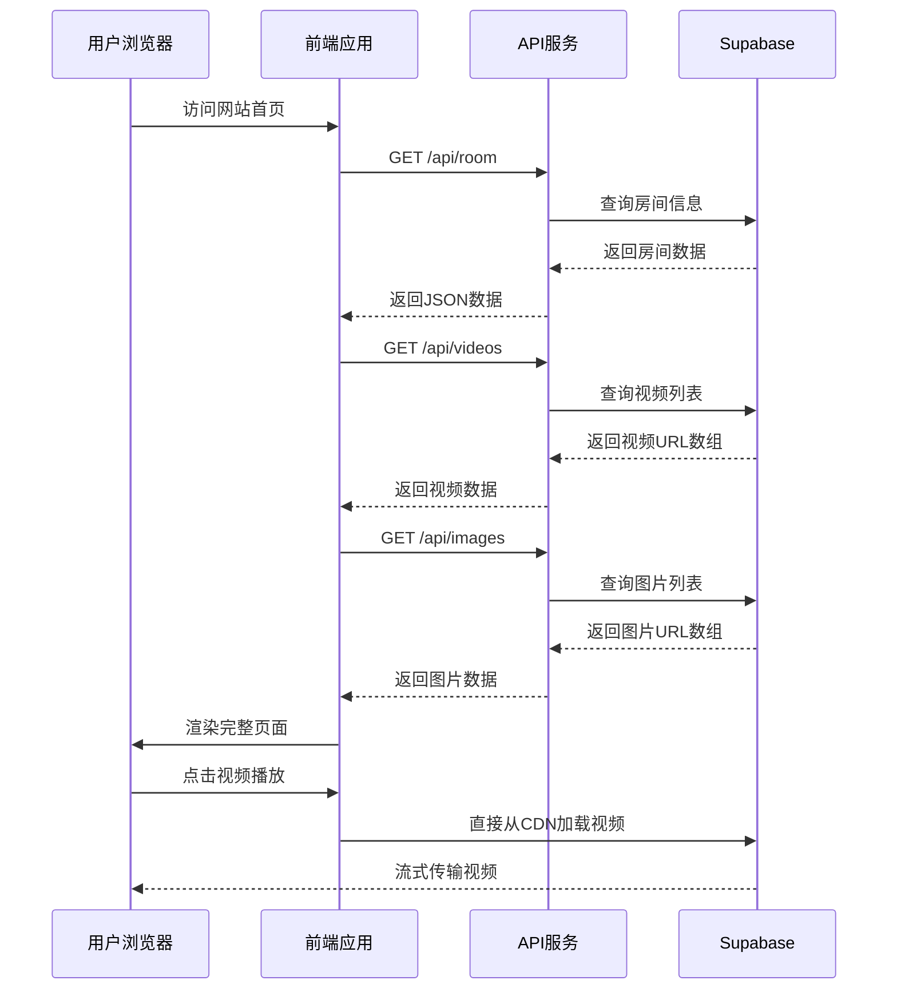
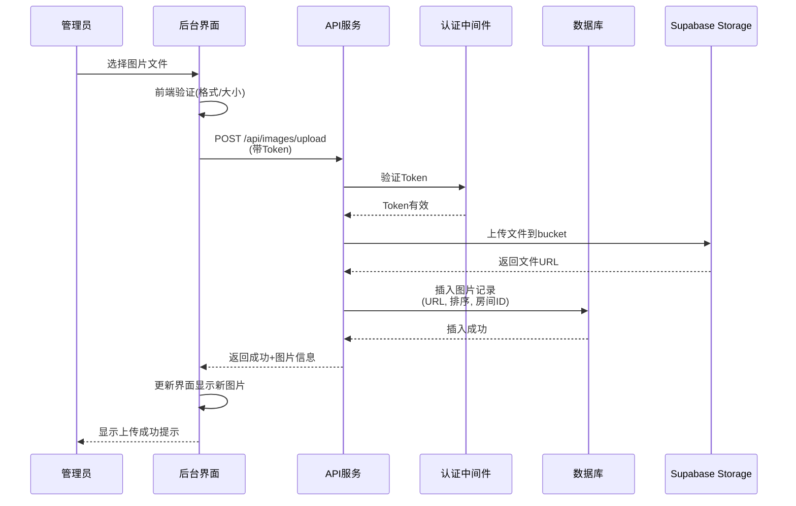
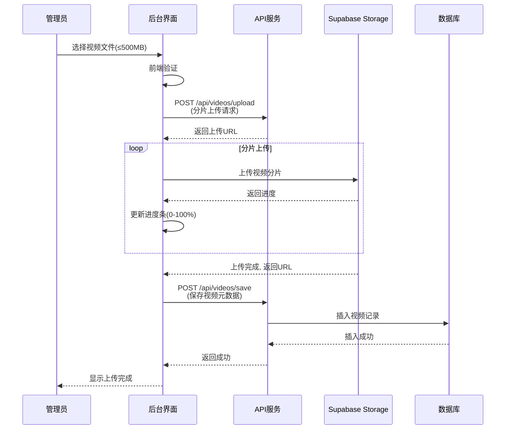
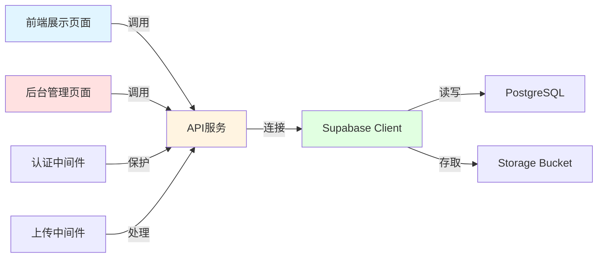

# 📋 产品路线图 (Product Roadmap)

## 核心目标 (Mission)
打造一个温馨优雅的民宿展示平台，让房东能够通过简单的后台操作，随时更新多媒体内容，并通过一个链接向潜在客户完整展示民宿的魅力。

## 用户画像 (Persona)

### 主要用户：房东（您）
- **核心需求**：快速分享民宿信息，无需每次单独发送图片/视频
- **痛点**：
  - 微信/邮件发送大量图片视频繁琐且不专业
  - 第三方平台展示受限，无法完全体现民宿特色
  - 需要一个"数字名片"式的展示窗口
- **技术水平**：基础互联网使用能力，需要简单易用的后台

### 次要用户：潜在客户
- **核心需求**：快速全面了解民宿环境、设施、位置
- **痛点**：
  - 图片零散，缺乏整体感受
  - 想看视频但房东发送不便
  - 需要一站式获取所有信息（图片+视频+联系方式）

---

## V1: 最小可行产品 (MVP)

### 前端展示模块
1. **首页 (Landing Page)**
   - 品牌区：民宿名称 + Slogan
   - 视频播放器：展示主视频（自动播放/静音可选）
   - 快速导航：进入房间详情的CTA按钮
   - 联系方式快捷入口（悬浮或固定底部）

2. **房间详情页 (Room Detail)**
   - 图片画廊（10-20张）：
     - 宫格布局 + 点击放大查看
     - 支持左右滑动浏览
   - 视频播放区（3-5个视频）：
     - 视频缩略图列表
     - 点击切换播放
     - 支持全屏播放
   - 文字信息区：
     - 房间名称
     - 特色标语
     - 详细描述（富文本格式）
   
3. **联系方式页 (Contact)**
   - 电话号码（点击拨打）
   - 微信二维码（可下载保存）
   - 地址 + 嵌入式地图（高德/百度地图）
   - 邮箱（点击发送邮件）
   - 社交媒体图标链接（小红书/抖音/Instagram等）

4. **响应式设计**
   - 完美适配手机/平板/电脑
   - 图片自动压缩优化加载速度

### 后端管理模块
5. **登录认证系统**
   - 账号密码登录
   - 记住登录状态（7天）
   - 安全退出

6. **内容管理面板**
   - **房间信息编辑**：
     - 房间名称输入框
     - Slogan输入框
     - 详细描述富文本编辑器
   
   - **图片管理**：
     - 批量上传（支持JPG/PNG/GIF）
     - 拖拽排序
     - 单张删除
     - 设置封面图
     - 图片预览
   
   - **视频管理**：
     - 单个上传（≤500MB）
     - 支持3-5个视频
     - 删除/替换
     - 设置主视频（首页展示）
     - 上传进度条显示
   
   - **联系方式设置**：
     - 电话号码输入
     - 微信二维码上传
     - 地址输入 + 地图坐标选择
     - 邮箱输入
     - 社交媒体链接管理（添加/删除）

7. **实时预览功能**
   - 修改后可点击"预览"按钮查看前端效果
   - 确认无误后点击"发布"正式更新

### 技术基础设施
8. **Supabase集成**
   - 数据库：存储房间信息、文字内容、联系方式
   - 存储桶：图片和视频文件存储
   - 认证：后台登录验证

9. **性能优化**
   - 图片懒加载
   - 视频流式加载
   - CDN加速（Supabase自带）

---

## V2 及以后版本 (Future Releases)

### V2.0 - 多房间支持（扩展期）
- 支持添加多套房间
- 房间列表页设计
- 每个房间独立管理
- 房间状态标记（可预订/已满）

### V2.1 - 增强体验
- 360度全景看房
- 图片对比滑块（装修前后对比）
- 访客数据统计（浏览量、停留时间）
- 分享功能（生成海报、复制链接）

### V2.2 - 营销功能
- 客户留言板/评价展示
- 优惠活动banner
- 邮件订阅功能
- 多语言版本（中英文切换）

### V3.0 - 预订系统
- 日历房态查询
- 在线预订表单
- 价格计算器
- 订单管理后台

---

## 关键业务逻辑 (Business Rules)

### MVP 核心规则
1. **内容发布流程**：
   - 后台编辑 → 实时预览 → 确认发布 → 前端立即更新

2. **文件上传限制**：
   - 图片：单张≤10MB，总数10-20张
   - 视频：单个≤500MB，总数3-5个
   - 格式：图片支持JPG/PNG/GIF，视频支持MP4/MOV

3. **权限控制**：
   - 仅登录用户可访问后台
   - 前端展示页面无需登录，公开访问

4. **数据持久化**：
   - 所有修改实时保存到Supabase
   - 文件上传成功后生成永久访问链接

5. **排序逻辑**：
   - 图片按上传顺序或手动拖拽顺序展示
   - 视频列表第一个为"主视频"，在首页展示

---

## 数据契约 (Data Contract)

### 数据库表结构

#### 1. `room_info` 表（房间信息）
```
{
  id: UUID (主键),
  room_name: String (房间名称),
  slogan: String (标语),
  description: Text (详细描述，富文本),
  created_at: Timestamp,
  updated_at: Timestamp
}
```

#### 2. `images` 表（图片）
```
{
  id: UUID (主键),
  room_id: UUID (外键),
  file_url: String (Supabase存储URL),
  file_name: String,
  sort_order: Integer (排序),
  is_cover: Boolean (是否封面),
  created_at: Timestamp
}
```

#### 3. `videos` 表（视频）
```
{
  id: UUID (主键),
  room_id: UUID (外键),
  file_url: String (Supabase存储URL),
  file_name: String,
  file_size: Integer (MB),
  is_primary: Boolean (是否主视频),
  sort_order: Integer,
  created_at: Timestamp
}
```

#### 4. `contact_info` 表（联系方式）
```
{
  id: UUID (主键),
  phone: String,
  wechat_qr_url: String (二维码图片URL),
  email: String,
  address: String,
  map_lat: Float (纬度),
  map_lng: Float (经度),
  social_media: JSON (社交媒体链接数组),
  updated_at: Timestamp
}
```

### API 端点设计

#### 前端 API
- `GET /api/room` - 获取房间信息
- `GET /api/images` - 获取图片列表
- `GET /api/videos` - 获取视频列表
- `GET /api/contact` - 获取联系方式

#### 后台 API
- `POST /api/auth/login` - 登录
- `POST /api/auth/logout` - 登出
- `PUT /api/room` - 更新房间信息
- `POST /api/images/upload` - 上传图片
- `DELETE /api/images/:id` - 删除图片
- `PUT /api/images/reorder` - 调整图片顺序
- `POST /api/videos/upload` - 上传视频
- `DELETE /api/videos/:id` - 删除视频
- `PUT /api/contact` - 更新联系方式

---

现在进入原型设计阶段！我将为您绘制 **3种不同设计理念的MVP原型图**，请您选择最喜欢的一个。

---

# 🎨 MVP 原型设计方案

## 方案A：经典卡片式布局（温馨优雅）

```
┌─────────────────────────────────────────────────────────┐
│                    🏡 [民宿名称]                          │
│              "让心灵在这里找到归属"                        │
│                                                           │
│  ┌─────────────────────────────────────────────────┐    │
│  │                                                   │    │
│  │         [主视频播放器 - 自动播放]                 │    │
│  │              🎬 1920x1080                         │    │
│  │                                                   │    │
│  └─────────────────────────────────────────────────┘    │
│                                                           │
│              [📖 查看房间详情] 按钮                       │
│                                                           │
│  ─────────────────────────────────────────────────────  │
│                                                           │
│  📞 快速联系                                              │
│  ☎️ 138-xxxx-xxxx  💬 微信  📍 查看位置                  │
└─────────────────────────────────────────────────────────┘

【向下滚动 - 房间详情页】

┌─────────────────────────────────────────────────────────┐
│  ← 返回首页              [房间名称]                       │
│                                                           │
│  ┌──────────┬──────────┬──────────┬──────────┐          │
│  │  [图1]   │  [图2]   │  [图3]   │  [图4]   │          │
│  │  大图    │          │          │          │          │
│  └──────────┴──────────┴──────────┴──────────┘          │
│  ┌──────────┬──────────┬──────────┬──────────┐          │
│  │  [图5]   │  [图6]   │  [图7]   │  [图8]   │          │
│  └──────────┴──────────┴──────────┴──────────┘          │
│                    ... 更多图片                           │
│                                                           │
│  ─────────────────────────────────────────────────────  │
│                                                           │
│  🎬 视频展示                                              │
│  ┌──────────┐ ┌──────────┐ ┌──────────┐                 │
│  │ [视频1]  │ │ [视频2]  │ │ [视频3]  │                 │
│  │  缩略图  │ │  缩略图  │ │  缩略图  │                 │
│  └──────────┘ └──────────┘ └──────────┘                 │
│                                                           │
│  ─────────────────────────────────────────────────────  │
│                                                           │
│  📝 房间介绍                                              │
│  这是一间充满温馨气息的房间，采用北欧简约风格...         │
│  · 面积：45㎡                                             │
│  · 设施：独立卫浴、智能家居、观景阳台                     │
│  · 特色：落地窗、榻榻米茶室、猫咪友好                     │
│                                                           │
│  ─────────────────────────────────────────────────────  │
│                                                           │
│  📞 联系我们                                              │
│  ☎️  电话：138-xxxx-xxxx                                 │
│  💬  微信：[二维码图片]                                   │
│  📧  邮箱：hello@example.com                             │
│  📍  地址：杭州市西湖区xx路xx号                           │
│      [嵌入式地图]                                         │
│  🔗  小红书 | 抖音 | Instagram                           │
│                                                           │
└─────────────────────────────────────────────────────────┘
```

**设计理念**：
- ✨ 温馨舒适的暖色调（米白+浅木色+暖橙）
- 🎯 视频优先，首屏即震撼
- 📱 移动端友好，大按钮易点击
- 🌸 圆角卡片设计，柔和亲切

---

## 方案B：杂志式沉浸布局（艺术感）

```
┌─────────────────────────────────────────────────────────┐
│                                                           │
│                  [全屏背景视频 - 循环播放]                │
│                                                           │
│                    🏡 [民宿名称]                          │
│                "让心灵在这里找到归属"                      │
│                                                           │
│                      [向下探索 ↓]                         │
│                                                           │
└─────────────────────────────────────────────────────────┘

【向下滚动 - 图片故事式展示】

┌─────────────────────────────────────────────────────────┐
│                                                           │
│  ┌───────────────────────────────────────────────────┐  │
│  │                                                     │  │
│  │              [超大图片1 - 全宽展示]                │  │
│  │                                                     │  │
│  └───────────────────────────────────────────────────┘  │
│                                                           │
│              "清晨的阳光洒满房间"                         │
│                                                           │
│  ┌──────────────────┐    ┌──────────────────┐          │
│  │    [图片2]       │    │    [图片3]       │          │
│  │                  │    │                  │          │
│  └──────────────────┘    └──────────────────┘          │
│                                                           │
│  ┌───────────────────────────────────────────────────┐  │
│  │         [视频播放器 - 手动播放]                    │  │
│  └───────────────────────────────────────────────────┘  │
│                                                           │
│              "每个角落都有故事"                           │
│                                                           │
│  [更多图片以瀑布流/错位排列展示...]                       │
│                                                           │
│  ─────────────────────────────────────────────────────  │
│                                                           │
│  📝 关于这个空间                                          │
│  [详细描述文字]                                           │
│                                                           │
│  ─────────────────────────────────────────────────────  │
│                                                           │
│  📞 联系方式 [左右分栏布局]                               │
│  左侧：文字信息    右侧：二维码+地图                      │
│                                                           │
└─────────────────────────────────────────────────────────┘
```

**设计理念**：
- 🎨 杂志式排版，艺术气息浓厚
- 📸 图片为王，大图沉浸式体验
- 🌊 瀑布流布局，自然流畅
- 🖼️ 适合摄影质量高的民宿

---

## 方案C：极简功能式布局（高效直接）

```
┌─────────────────────────────────────────────────────────┐
│  🏡 [Logo] 民宿名称        [首页][相册][视频][联系]      │
├─────────────────────────────────────────────────────────┤
│                                                           │
│  ┌─────────────────┐  ┌─────────────────────────────┐  │
│  │                 │  │  [房间名称]                  │  │
│  │   [主视频]      │  │                              │  │
│  │   播放器        │  │  "一句话描述房间特色"        │  │
│  │                 │  │                              │  │
│  │   🎬 播放       │  │  · 10-20张精美图片           │  │
│  │                 │  │  · 3-5个实景视频             │  │
│  └─────────────────┘  │  · 完整设施介绍              │  │
│                        │                              │  │
│                        │  [📸 查看相册] [🎬 观看视频] │  │
│                        └─────────────────────────────┘  │
│                                                           │
│  ─────────────────────────────────────────────────────  │
│                                                           │
│  📸 图片相册 (10-20张)                                    │
│  ┌────┬────┬────┬────┬────┬────┐                        │
│  │ 1  │ 2  │ 3  │ 4  │ 5  │ 6  │  [点击任意图片放大]    │
│  ├────┼────┼────┼────┼────┼────┤                        │
│  │ 7  │ 8  │ 9  │ 10 │ 11 │ 12 │                        │
│  └────┴────┴────┴────┴────┴────┘                        │
│                                                           │
│  🎬 视频集 (3-5个)                                        │
│  ┌──────────┐ ┌──────────┐ ┌──────────┐                 │
│  │ 视频1    │ │ 视频2    │ │ 视频3    │                 │
│  │ [缩略图] │ │ [缩略图] │ │ [缩略图] │                 │
│  │ ▶️ 播放  │ │ ▶️ 播放  │ │ ▶️ 播放  │                 │
│  └──────────┘ └──────────┘ └──────────┘                 │
│                                                           │
│  📝 详细介绍                                              │
│  [富文本内容展示区域]                                     │
│                                                           │
│  📞 联系方式                                              │
│  ┌─────────────────┬─────────────────┬─────────────┐    │
│  │ ☎️ 138-xxxx-xxx │ 💬 [微信二维码] │ 📍 [地图]   │    │
│  │ 📧 email@xx.com │ 🔗 社交媒体     │             │    │
│  └─────────────────┴─────────────────┴─────────────┘    │
│                                                           │
└─────────────────────────────────────────────────────────┘
```

**设计理念**：
- ⚡ 极简高效，所有内容一页展示
- 🎯 分区清晰，快速定位信息
- 📊 网格布局，整齐规范
- 💼 适合追求效率的商务风格

---

## 🎯 后台管理界面（通用设计）

```
┌─────────────────────────────────────────────────────────┐
│  🏡 民宿管理后台                        👤 管理员 [退出] │
├─────────────────────────────────────────────────────────┤
│                                                           │
│  ┌───────────┐                                           │
│  │ 📝 房间信息│ ◀━━ 当前选中                             │
│  │ 📸 图片管理│                                           │
│  │ 🎬 视频管理│                                           │
│  │ 📞 联系方式│                                           │
│  │ 👁️ 预览网站│                                           │
│  └───────────┘                                           │
│                                                           │
│  房间信息编辑                                             │
│  ┌─────────────────────────────────────────────────┐    │
│  │ 房间名称：[________________输入框________________]│    │
│  │                                                   │    │
│  │ 标语：    [________________输入框________________]│    │
│  │                                                   │    │
│  │ 详细描述：                                        │    │
│  │ ┌───────────────────────────────────────────┐   │    │
│  │ │ [富文本编辑器]                             │   │    │
│  │ │  B  I  U  | 🔗 📸 | H1 H2 | • 1.          │   │    │
│  │ │ ─────────────────────────────────────────  │   │    │
│  │ │                                            │   │    │
│  │ │  输入房间描述...                           │   │    │
│  │ │                                            │   │    │
│  │ └───────────────────────────────────────────┘   │    │
│  │                                                   │    │
│  │              [💾 保存] [👁️ 预览] [🔄 重置]        │    │
│  └─────────────────────────────────────────────────┘    │
│                                                           │
└─────────────────────────────────────────────────────────┘

【图片管理页面】

┌─────────────────────────────────────────────────────────┐
│  图片管理 (当前：12/20张)                                 │
│                                                           │
│  [📤 上传图片] (支持批量上传，JPG/PNG/GIF，单张≤10MB)   │
│                                                           │
│  ┌────────┬────────┬────────┬────────┬────────┐         │
│  │ [图1]  │ [图2]  │ [图3]  │ [图4]  │ [图5]  │         │
│  │ ⭐封面 │        │        │        │        │         │
│  │ [删除] │ [删除] │ [删除] │ [删除] │ [删除] │         │
│  │ [设为封面]                                  │         │
│  └────────┴────────┴────────┴────────┴────────┘         │
│                                                           │
│  💡 提示：拖拽图片可调整显示顺序                          │
│                                                           │
└─────────────────────────────────────────────────────────┘

【视频管理页面】

┌─────────────────────────────────────────────────────────┐
│  视频管理 (当前：3/5个)                                   │
│                                                           │
│  [📤 上传视频] (单个≤500MB，支持MP4/MOV)                │
│                                                           │
│  ┌──────────────────────────────────────────────────┐   │
│  │ 视频1：room_tour.mp4 (245MB) ⭐主视频            │   │
│  │ ▶️ 预览 | 🗑️ 删除 | [设为主视频]                 │   │
│  │ ━━━━━━━━━━━━━━━━━━━━━━━━━━━━━━━━━━━━━━━━━━━━ │   │
│  └──────────────────────────────────────────────────┘   │
│                                                           │
│  ┌──────────────────────────────────────────────────┐   │
│  │ 视频2：bathroom.mp4 (180MB)                      │   │
│  │ ▶️ 预览 | 🗑️ 删除 | [设为主视频]                 │   │
│  └──────────────────────────────────────────────────┘   │
│                                                           │
│  ┌──────────────────────────────────────────────────┐   │
│  │ 📤 上传中：balcony_view.mp4                      │   │
│  │ ████████████░░░░░░░░░░░░░░░░░░░░░░░░ 45%        │   │
│  └──────────────────────────────────────────────────┘   │
│                                                           │
└─────────────────────────────────────────────────────────┘
```

---

# 🏗️ 架构设计蓝图

## 系统架构图



## 核心业务流程图

### 1. 用户访问前端展示页面流程



### 2. 后台上传图片流程



### 3. 后台上传视频流程（大文件处理）



---

## 组件交互说明

### 前端组件结构

```
src/
├── frontend/                 # 前端展示页面
│   ├── components/
│   │   ├── HomePage.jsx      # 首页组件(视频+CTA)
│   │   ├── RoomDetail.jsx    # 房间详情页
│   │   ├── ImageGallery.jsx  # 图片画廊组件
│   │   ├── VideoPlayer.jsx   # 视频播放器组件
│   │   └── ContactSection.jsx# 联系方式组件
│   ├── services/
│   │   └── api.js            # API调用封装
│   └── App.jsx               # 前端路由
│
├── backend-admin/            # 后台管理页面
│   ├── components/
│   │   ├── Login.jsx         # 登录页
│   │   ├── Dashboard.jsx     # 仪表盘
│   │   ├── RoomEditor.jsx    # 房间信息编辑
│   │   ├── ImageManager.jsx  # 图片管理
│   │   ├── VideoManager.jsx  # 视频管理
│   │   └── ContactEditor.jsx # 联系方式编辑
│   ├── services/
│   │   ├── auth.js           # 认证服务
│   │   └── upload.js         # 文件上传服务
│   └── App.jsx               # 后台路由
│
└── shared/                   # 共享组件
    ├── hooks/
    │   └── useSupabase.js    # Supabase连接Hook
    └── utils/
        ├── imageOptimizer.js # 图片压缩工具
        └── validator.js      # 表单验证工具
```

### 后端API结构

```
server/
├── index.js                  # Express服务器入口
├── routes/
│   ├── auth.js               # 认证路由
│   ├── room.js               # 房间信息路由
│   ├── images.js             # 图片管理路由
│   ├── videos.js             # 视频管理路由
│   └── contact.js            # 联系方式路由
├── middleware/
│   ├── auth.js               # JWT验证中间件
│   ├── upload.js             # 文件上传中间件
│   └── errorHandler.js       # 错误处理中间件
├── controllers/
│   ├── roomController.js     # 房间业务逻辑
│   ├── imageController.js    # 图片业务逻辑
│   ├── videoController.js    # 视频业务逻辑
│   └── contactController.js  # 联系方式业务逻辑
├── services/
│   └── supabaseClient.js     # Supabase客户端配置
└── config/
    └── config.js             # 环境配置
```

### 模块依赖关系



---

## 技术选型与风险评估

### 核心技术栈

| 层级 | 技术选型 | 理由 | 风险 |
|------|---------|------|------|
| **前端框架** | React 18 + Vite | 快速开发、生态成熟、性能优秀 | ⚠️ 需要学习React Hooks |
| **UI框架** | TailwindCSS | 快速构建响应式界面、文件体积小 | ⚠️ 初期类名较多 |
| **后端框架** | Node.js + Express | 轻量、与前端技术栈统一 | ⚠️ 需要手动处理异步错误 |
| **数据库** | Supabase (PostgreSQL) | 自带认证、存储、实时订阅 | ⚠️ 免费版有存储限制(1GB) |
| **文件存储** | Supabase Storage | 自带CDN、与数据库集成 | ⚠️ 大视频文件可能需要付费套餐 |
| **认证** | JWT + Supabase Auth | 无状态、安全、易扩展 | ⚠️ 需要妥善保管密钥 |
| **视频播放** | Video.js | 支持流式播放、自定义UI | ⚠️ 大文件加载需要优化 |
| **图片优化** | Sharp (服务端) | 自动压缩、格式转换 | ⚠️ 增加服务器计算负担 |

### 关键技术决策

#### 1. 视频处理方案
**选择**：直接存储原始视频 + 前端自适应播放
- ✅ 优点：实现简单、保留原始质量
- ⚠️ 风险：500MB视频加载慢
- 🔧 缓解措施：
  - 使用视频流式加载(不等下载完就播放)
  - 提示用户压缩视频后再上传
  - V2版本考虑服务端转码

#### 2. 图片优化策略
**选择**：上传时服务端自动压缩 + 多尺寸生成
- ✅ 优点：前端加载快、节省带宽
- ⚠️ 风险：服务器处理时间增加
- 🔧 缓解措施：
  - 异步处理(后台队列)
  - 显示上传进度条
  - 原图和缩略图分别存储

#### 3. 数据库设计
**选择**：关系型数据库(PostgreSQL)
- ✅ 优点：数据结构清晰、支持复杂查询
- ⚠️ 风险：MVP阶段可能过度设计
- 🔧 缓解措施：
  - 保持表结构简单
  - 预留扩展字段(JSON类型)

### 性能优化方案

1. **前端优化**
   - 图片懒加载(Intersection Observer)
   - 代码分割(React.lazy)
   - 静态资源CDN加速

2. **后端优化**
   - API响应缓存(Redis - V2考虑)
   - 数据库查询优化(索引)
   - 文件上传限流(防止滥用)

3. **Supabase优化**
   - 启用Row Level Security(数据安全)
   - 配置Storage CDN
   - 监控存储用量

### 潜在技术风险与应对

| 风险 | 可能性 | 影响 | 应对方案 |
|------|--------|------|---------|
| Supabase免费额度不足 | 中 | 高 | 监控用量，准备升级方案 |
| 大视频上传失败 | 高 | 中 | 分片上传+断点续传 |
| 并发上传导致服务器压力 | 低 | 中 | 限制同时上传数量 |
| 图片格式兼容性问题 | 低 | 低 | 统一转换为WebP格式 |
| 移动端视频播放卡顿 | 中 | 高 | 提供多码率选择(V2) |

---

## 部署方案

### 推荐部署架构

```
┌─────────────────────────────────────────┐
│         Vercel / Netlify                │
│    (前端静态页面 + 后台管理页面)          │
└─────────────────┬───────────────────────┘
                  │
                  ↓ API调用
┌─────────────────────────────────────────┐
│         Railway / Render                │
│       (Node.js API服务器)                │
└─────────────────┬───────────────────────┘
                  │
                  ↓ 数据存取
┌─────────────────────────────────────────┐
│            Supabase Cloud               │
│    (数据库 + 文件存储 + 认证)            │
└─────────────────────────────────────────┘
```

### 环境配置

```env
# Supabase配置
SUPABASE_URL=https://xxx.supabase.co
SUPABASE_ANON_KEY=eyJxxx...
SUPABASE_SERVICE_KEY=eyJxxx...

# JWT密钥
JWT_SECRET=your-secret-key-here

# 文件上传限制
MAX_IMAGE_SIZE=10485760  # 10MB
MAX_VIDEO_SIZE=524288000 # 500MB

# CORS配置
ALLOWED_ORIGINS=https://your-domain.com
```

---

## 开发里程碑

### Phase 1: 基础架构搭建 (3-5天)
- [ ] 初始化项目(前端+后端)
- [ ] 配置Supabase连接
- [ ] 搭建基础路由
- [ ] 实现登录认证

### Phase 2: 后台管理开发 (5-7天)
- [ ] 房间信息编辑功能
- [ ] 图片上传/删除/排序
- [ ] 视频上传/删除
- [ ] 联系方式管理

### Phase 3: 前端展示开发 (4-6天)
- [ ] 首页设计实现
- [ ] 图片画廊组件
- [ ] 视频播放器集成
- [ ] 联系方式页面

### Phase 4: 优化与测试 (3-4天)
- [ ] 响应式适配
- [ ] 性能优化
- [ ] 跨浏览器测试
- [ ] 用户体验调优

### Phase 5: 部署上线 (1-2天)
- [ ] 生产环境配置
- [ ] 域名绑定
- [ ] SSL证书配置
- [ ] 正式发布

**预计总开发时间：16-24天**

---

# 📊 成本估算

| 项目 | 方案 | 月费用 |
|------|------|--------|
| Supabase | 免费版(1GB存储) | $0 |
| Supabase | Pro版(8GB存储) | $25 |
| 前端托管 | Vercel免费版 | $0 |
| API服务器 | Railway免费版 | $0 |
| API服务器 | Railway付费版 | $5-10 |
| 域名 | .com域名 | ~$1 |
| **MVP总成本** | **免费方案** | **$0-1/月** |
| **推荐方案** | **付费方案** | **$30-36/月** |

💡 **建议**：MVP阶段使用免费方案验证，待流量增长后升级。

---

现在请您**选择一个前端设计方案**（A/B/C），或者告诉我您的偏好，我将基于您的选择生成最终的 **PRD.md** 文档！🎯

**您的选择是？**
- 🅰️ 方案A - 经典卡片式（温馨优雅）
- 🅱️ 方案B - 杂志式沉浸（艺术感）
- 🅲️ 方案C - 极简功能式（高效直接）
- 🎨 或者描述您的理想风格，我为您定制！